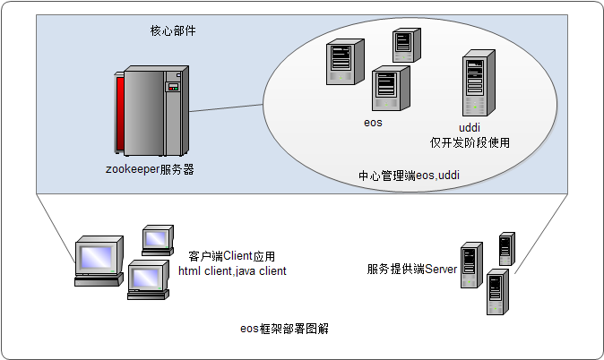
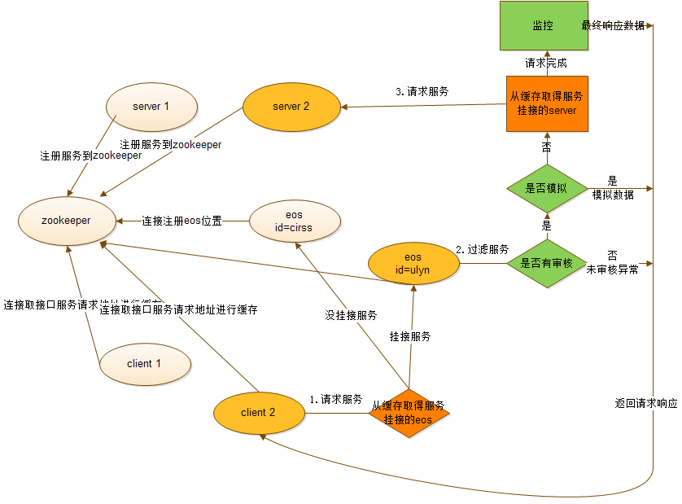

# EOS概述篇

## 一、简介
### 租车行：
迭代模式带来一系列问题，静态页面套成动态后，一些操作，业务，模版技术等动态页面
已经跟静态页面有了一些差距。这时候前端人员改了一个BUG，或者叠加了一个功能，后端
人员就必须向前端人员了解更改的范围，再叠加，由于都是人为过程，带来很多困扰。
开发效率也很低。

### 民生集美：
前后端配合的问题。一般的流程是前后端约定好接口，就各自开发。由于难易度或者其他工
作的交叉，前后端很难一起同一时间完成，这时候前端人员就必须自己写测试报文，测试。
后端相对简单一些，可以采用单元测试。联调时：测试报文和实际报文如果有差异，就需要
前端人员花费比较大时间去排查到底是前端问题还是后端问题，没有办法集中精力做好前端
交互的工作（浏览器兼容性等）。

###  测试：
对于租车行，静态的测试并不能很好反应，最后的成果，带来的测试工作量将会加大一倍，
静态，动态都得测试相同的问题，返工的概率也很大。对于民生集美，由于静态页面就是最
后成果，测试成果就反应了最后的成果，带来的工作量相对来说较少。

###  为了避免或者减轻上述弊端，分布式服务框架eos诞生了！

## 二、EOS设计原则

它的核心是接口，希望能有效减少民生集美模式的弊端。

（1）规范接口，接口要求前端，后端，测试人员都能看懂，能用。而且接口是直接引用到
我们的程序中，任何更改都有相关的记录，相关人员的审核。

（2）接口的可测试性。由测试人员直接介入到接口的测试中来，首先保证接口的正确性，
给后面的联调工作带来无法估量的好处，理想情况一次通过。而且测试人员可以直接判断错
误的来源，到底是前端还是后端

（3）前端人员不用等待后端的开发，接口中就规定了模拟报文，前端人员直接开发，而且
后面联调时代码也不需要调整，只需要更改一个参数，就可以自动切换到后端程序。

（4）前端，后端，测试各司其职，互不影响，很好体现了解耦的思想

（5）后端开发人员技术上跟现在没有变化，技术门槛低，直接开发到Spring的服务层就可
以了，采用单元测试，更快提高效率

## 三、角色职责
定义的职责是大部分跟接口相关的，得接口得天下。

（1）java后端开发程序员：和前端人员沟通，定义接口；不能私自更改接口，有更改必须更
相关的前端人员沟通；对一些重要的调整，请跟小组长联系；

（2）前端开发人员：参与定制接口；

（3）小组长：检查程序员接口的规范性，是否存在没必要的冗余；协助程序员和前端人员
的沟通；直接参与一些重要模块的接口定制；切实起到小组长的作用，在做审批接口的时候，
最好能够做代码审查，包括单元测试是否完备。

（4）测试人员：参与到接口的测试中来；以后技能提升了以后，可以直接参与单元测试
（我们考虑开发一些工具(API），实现自动测试）；有一个不成熟想法，前端，后端各自
提交成果测试，测试完成后，由测试这边统一联调（个人认为基本上工作量不会很大了）。

## 四、系统组成
eos包含以下几部分：

（1）服务提供端Server：后端开发者重点关注，根据提供的eos-server.jar包开发应用。

（2）中心管理端：包含控制端eos程序和界面配置端uddi程序。也是直接部署即可。

（3）客户端Client：前端开发者重点关注，根据eos-client.jar包和jquery.eosremote.js
开发应用。

（4）zookeeper：此程序为第三方应用直接下载部署即可，它是整个系统的强依赖，提供
服务端服务信息注册，提供eos管理端在线注册。

系统的组成部署图如下：  

## 五、系统执行流程

服务端发布服务，挂接到eos，客户端取得挂接有需要调用的服务的eos地址进行服务请求，
eos对请求进行过滤代理请求服务端服务数据，返回给客户端，具体图解如下：

可见，多了模拟数据获取的支持，eos轻松实现前后端分离开发，两端不需要同步等待。
并且，系统采用分布式思想，可以部署多台服务端和eos中心端以及客户端，轻松实现平行扩展。

