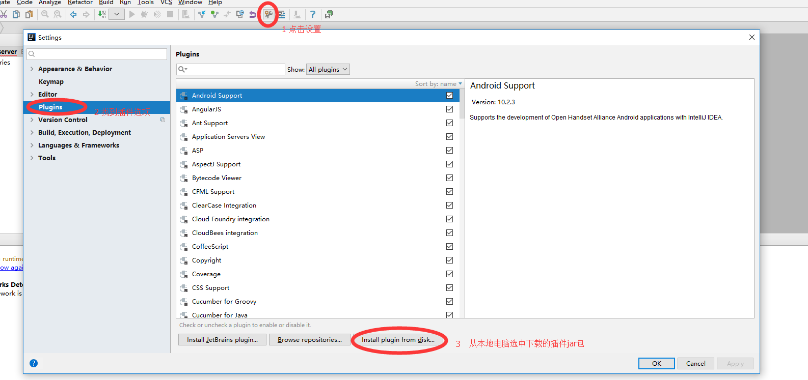
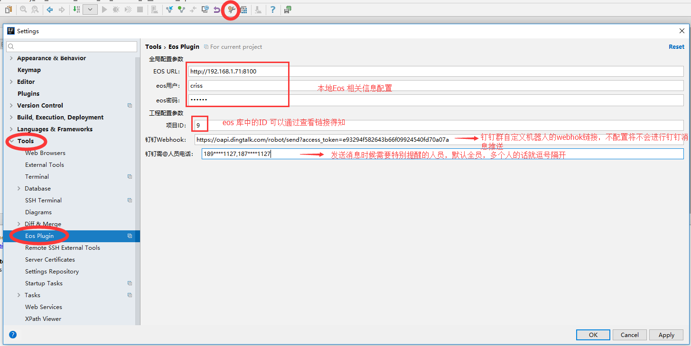
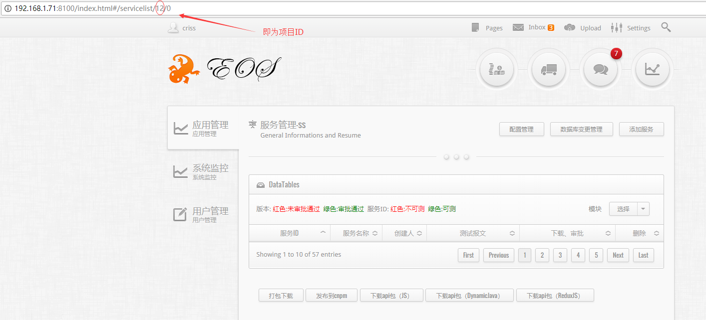
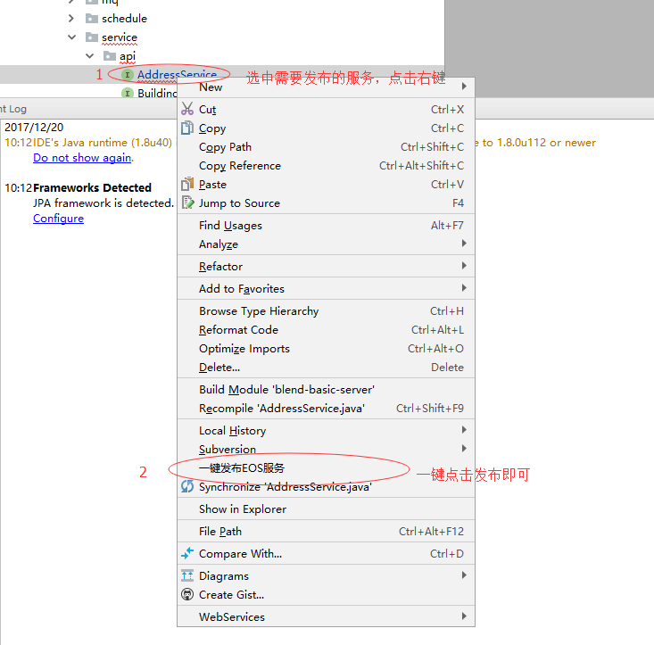

# Eos服务一键发布 使用说明

## 1.插件安装配置
### 1.1 插件安装

如下图进行插件的安装后重启idea



### 1.2 插件配置

  
项目id 查看如下：  
  
钉钉群自定义机器人配置：  
  
  
接下来按照提示下一步，就可以获取到如下图的webhok  

## 二、服务一键发布

## 注意目前1.0.1版本只支持
 服务注解如下的版本 （eos 3.2.5之后的包） ：
```
@EosService(desc="地址服务",module="通用")
```
## 其中 desc 为服务的中文名称，module 为管理员为此项目建立的模块名称，如有不知请咨询管理员。
